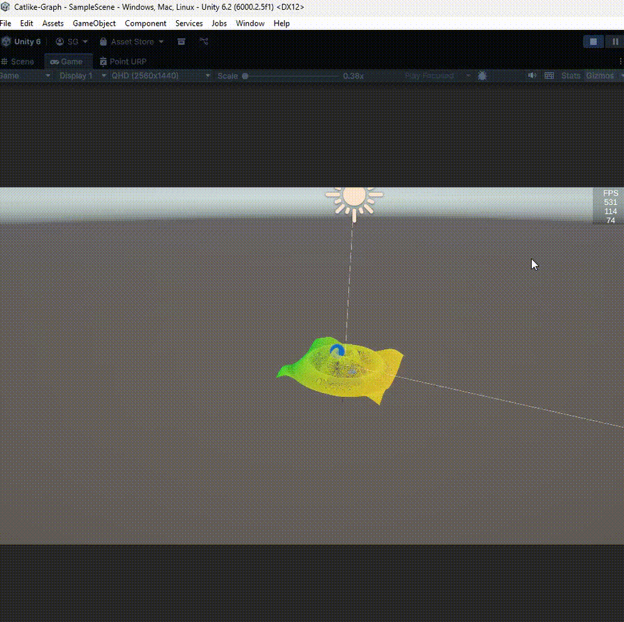

# Catlike-Graph

Simulation of 3D mathematical surfaces to gain an understanding of compute shaders in unity.

# Resources

Credit to Jasper Flick: https://catlikecoding.com/ for providing in depth tutorials on this topic.
